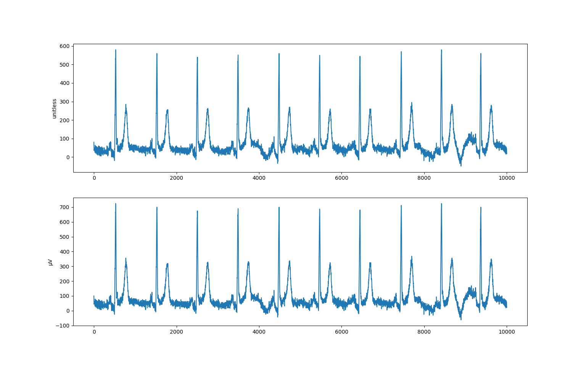
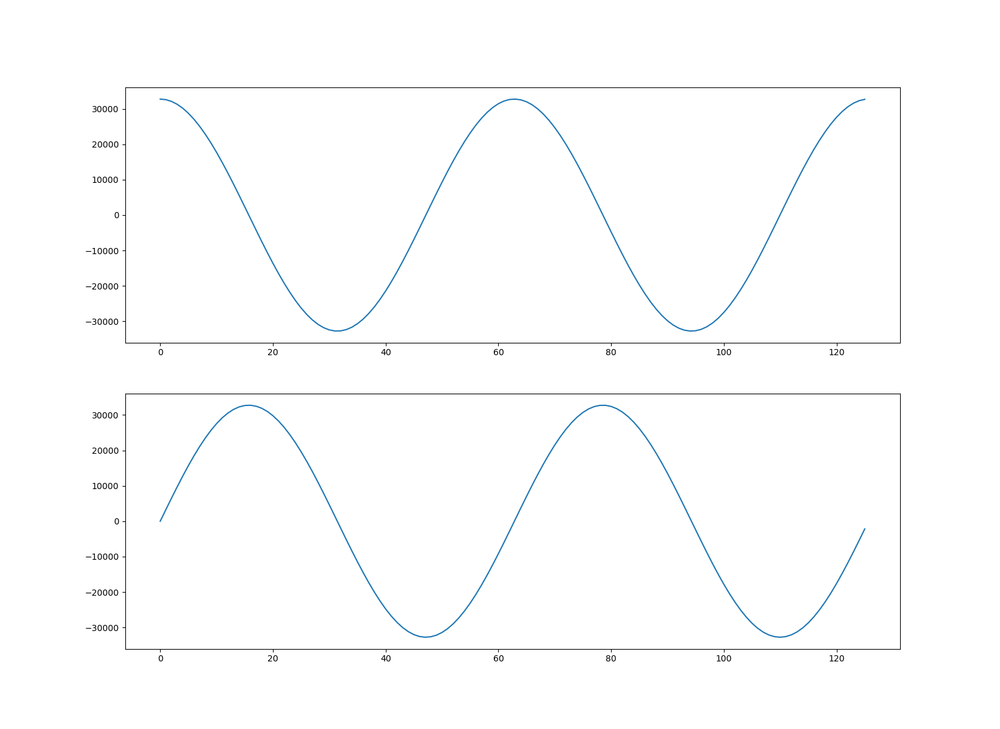

=========
Waveforms
=========

This tutorial is about understanding waveforms in DICOM datasets and covers:

* An introduction to DICOM waveforms
* Decoding and displaying *Waveform Data*
* Encoding *Waveform Data*

It's assumed that you're already familiar with the :doc:`dataset basics
<dataset_basics>`.

**Prerequisites**

.. code-block:: bash

    python -m pip install -U pydicom>=2.1 numpy matplotlib

.. code-block:: bash

    conda install numpy matplotlib
    conda install -c conda-forge pydicom>=2.1

**References**

* :dcm:`Waveform Module <part03/sect_C.10.9.html>`
* :dcm:`Waveform Explanatory Information<part17/chapter_C.html>`
* :dcm:`Waveform Information Model<part17/sect_C.5.html>`
* :dcm:`Waveform IODs<part03/sect_A.34.html>`

Waveforms in DICOM
==================

There are a number of DICOM :dcm:`Information Object Definitions
<part03/sect_A.34.html>` (IODs) that contain
waveforms, such as :dcm:`12-Lead ECG<part03/sect_A.34.3.html>`,
:dcm:`Respiratory Waveform<part03/sect_A.34.9.html>` and
:dcm:`Real-Time Audio Waveform<part03/sect_A.34.11.html>`. Every waveform IOD
uses the :dcm:`Waveform Module <part03/sect_C.10.9.html>` to represent one or
more multi-channel time-based digitized waveforms, sampled at constant time
intervals.

The waveforms within a dataset are contained in the items of the (5400,0100)
*Waveform Sequence* element:

.. code-block:: python

    >>> from pydicom import dcmread
    >>> from pydicom.data import get_testdata_file
    >>> fpath = get_testdata_file("waveform_ecg.dcm")
    >>> ds = dcmread(fpath)
    >>> ds.SOPClassUID.name
    '12-lead ECG Waveform Storage'
    >>> waveforms = ds.WaveformSequence
    >>> len(waveforms)
    2

Each item in the sequence is a *multiplex group*, which is a group of related
waveforms that are synchronised at common sampling frequency.

.. code-block:: python

    >>> multiplex = waveforms[0]
    >>> multiplex.MultiplexGroupLabel
    'RHYTHM'
    >>> multiplex.SamplingFrequency  # in Hz
    "1000.0"
    >>> multiplex.NumberOfWaveformChannels
    12
    >>> multiplex.NumberOfWaveformSamples
    10000

So the first multiplex group has 12 channels, each with 10,000 samples. Since
the sampling frequency is 1 kHz, this represents 10 seconds of data. The
defining information for each channel is available in the (5400,0200)
*Channel Definition Sequence*:

.. code-block:: python

    >>> for ii, channel in enumerate(multiplex.ChannelDefinitionSequence):
    ...     source = channel.ChannelSourceSequence[0].CodeMeaning
    ...     units = 'unitless'
    ...     if 'ChannelSensitivity' in channel:  # Type 1C, may be absent
    ...         units = channel.ChannelSensitivityUnitsSequence[0].CodeMeaning
    ...     print(f"Channel {ii + 1}: {source} ({units})")
    ...
    Channel 1: Lead I (Einthoven) (microvolt)
    Channel 2: Lead II (microvolt)
    Channel 3: Lead III (microvolt)
    Channel 4: Lead aVR (microvolt)
    Channel 5: Lead aVL (microvolt)
    Channel 6: Lead aVF (microvolt)
    Channel 7: Lead V1 (microvolt)
    Channel 8: Lead V2 (microvolt)
    Channel 9: Lead V3 (microvolt)
    Channel 10: Lead V4 (microvolt)
    Channel 11: Lead V5 (microvolt)
    Channel 12: Lead V6 (microvolt)

Decoding *Waveform Data*
========================

The combined sample data for each multiplex is stored in the corresponding
(5400,1010) *Waveform Data* element:

.. code-block:: python

   >>> multiplex.WaveformBitsAllocated
   16
   >>> multiplex.WaveformSampleInterpretation
   'SS'
   >>> len(multiplex.WaveformData)
   240000

If *Waveform Bits Allocated* is ``16`` and *Waveform Sample Interpretation* is
``'SS'`` then the data for this multiplex consists of :dcm:`signed 16-bit
samples <part03/sect_C.10.9.html#table_C.10-10>`. Waveform data is encoded
with the channels interleaved, so for our case the data is ordered as:

.. code-block:: text

    (Ch 1, Sample 1), (Ch 2, Sample 1), ..., (Ch 12, Sample 1),
    (Ch 1, Sample 2), (Ch 2, Sample 2), ..., (Ch 12, Sample 2),
    ...,
    (Ch 1, Sample 10,000), (Ch 2, Sample 10,000), ..., (Ch 12, Sample 10,000)

To decode the raw multiplex waveform data to a numpy :class:`~numpy.ndarray`
you can use the :func:`~pydicom.waveforms.numpy_handler.multiplex_array`
function. The following decodes and returns the raw data from the multiplex at
*index* ``0`` within the *Waveform Sequence*:

.. code-block:: python

    >>> from pydicom.waveforms import multiplex_array
    >>> raw = multiplex_array(ds, 0, as_raw=True)
    >>> raw[0, 0]
    80

If (003A,0210) *Channel Sensitivity* is present within the multiplex's *Channel
Definition Sequence* then the raw sample data needs to be corrected before it's
in the quantity it represents. This correction is given by sample x *Channel 
Sensitivity* x *Channel Sensitivity Correction Factor* + *Channel Baseline*
and will be applied when `as_raw` is ``False`` or when using the
:meth:`Dataset.waveform_array()<pydicom.dataset.Dataset.waveform_array>`
function:

    >>> arr = ds.waveform_array(0)
    >>> arr[0, 0]
    >>> 100.0
    >>> import matplotlib.pyplot as plt
    >>> fig, (ax1, ax2) = plt.subplots(2)
    >>> ax1.plot(raw[:, 0])
    >>> ax1.set_ylabel("unitless")
    >>> ax2.plot(arr[:, 0])
    >>> ax2.set_ylabel("μV")
    >>> plt.show()

When processing large amounts of waveform data it might be more efficient to
use the :func:`~pydicom.waveforms.numpy_handler.generate_multiplex` function
instead. It yields an :class:`~numpy.ndarray` for each multiplex group
within the *Waveform Sequence*:

.. code-block:: python

    >>> from pydicom.waveforms import generate_multiplex
    >>> for arr in generate_multiplex(ds, as_raw=False):
    ...     print(arr.shape)
    ...
    (10000, 12)
    (1200, 12)

Encoding *Waveform Data*
========================

Having seen how to decode and view a waveform then next step is creating our
own multiplex group. The new group will contain two channels
representing cosine and sine curves. We've chosen to represent our waveforms
using signed 16-bit integers, but you can use signed or unsigned 8, 16, 32 or
64-bit integers depending on the requirements of the IOD.

First we create two :class:`ndarrays<numpy.ndarray>` with our waveform data:

.. code-block:: python

    >>> import numpy as np
    >>> x = np.arange(0, 4 * np.pi, 0.1)
    >>> ch1 = (np.cos(x) * (2**15 - 1)).astype('int16')
    >>> ch2 = (np.sin(x) * (2**15 - 1)).astype('int16')

Next we create the new multiplex group that will contain the waveforms:

.. code-block:: python

    >>> from pydicom.dataset import Dataset
    >>> new = Dataset()
    >>> new.WaveformOriginality = "ORIGINAL"
    >>> new.NumberOfWaveformChannels = 2
    >>> new.NumberOfWaveformSamples = len(x)
    >>> new.SamplingFrequency = 1000.0

To find out which elements we need to add to our new multiplex, we check the
:dcm:`Waveform Module <part03/sect_C.10.9.html>` in Part 3 of the DICOM
Standard. Type 1 elements must be present and not empty, Type 1C are
conditionally required, Type 2 elements must be present but may be empty, and
Type 3 elements are optional.

Set our channel definitions, one for each channel (note that we have opted not
to include a *Channel Sensitivity*, so our data will be unit-less). If you were
to do this for real you would obviously use an official coding scheme.

.. code-block:: python

    >>> new.ChannelDefinitionSequence = [Dataset(), Dataset()]
    >>> chdef_seq = new.ChannelDefinitionSequence
    >>> for chdef, curve_type in zip(chdef_seq, ["cosine", "sine"]):
    ...     chdef.ChannelSampleSkew = "0"
    ...     chdef.WaveformBitsStored = 16
    ...     chdef.ChannelSourceSequence = [Dataset()]
    ...     source = chdef.ChannelSourceSequence[0]
    ...     source.CodeValue = "1.0"
    ...     source.CodingSchemeDesignator = "PYDICOM"
    ...     source.CodingSchemeVersion = "1.0"
    ...     source.CodeMeaning = curve_type

Interleave the waveform samples, convert to bytes and set the *Waveform Data*.
Since the dataset's transfer syntax is little endian, if you're working on
a big endian system you'll need to perform the necessary conversion. You can
determine the endianness of your system with ``import sys;
print(sys.byteorder)``.

We also set our corresponding *Waveform Bits Allocated* and *Waveform Sample
Interpretation* element values to match our data representation type:

.. code-block:: python

    >>> arr = np.stack((ch1, ch2), axis=1)
    >>> arr.shape
    (126, 2)
    >>> new.WaveformData = arr.tobytes()
    >>> new.WaveformBitsAllocated = 16
    >>> new.WaveformSampleInterpretation = 'SS'

And finally add the new multiplex group to our example dataset and save:

.. code-block:: python

    >>> ds.WaveformSequence.append(new)
    >>> ds.save_as("my_waveform.dcm")

We should now be able to plot our new waveforms:

.. code-block:: python

    >>> ds = dcmread("my_waveform.dcm")
    >>> arr = ds.waveform_array(2)
    >>> fig, (ax1, ax2) = plt.subplots(2)
    >>> ax1.plot(arr[:, 0])
    >>> ax2.plot(arr[:, 1])
    >>> plt.show()

